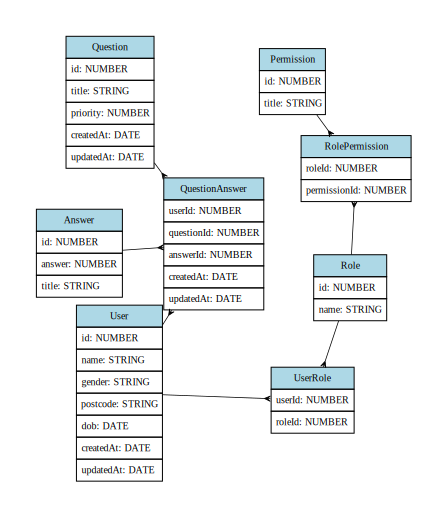

# Survey Backend

Node JS backend using express, postgres, express-validator, sequelize, sequelize-cli, sequelize-erd and jest

[Project UI](https://github.com/lyubo-velikoff/survey-ui) - using react, redux, tailwind

## Project sections

- [How to install](#Install)
- [How to start](#Start)
- [Swagger](#Swagger)
- [Sequelize CLI commands](#Commands)
- [Run test](#Test)
- [Generate ERD](#ERD)

## Install

1. Install dependencies
```
npm install
```

## Install

```
npm start
```

1. Copy .env.example into .env and fill in details

1. Run migration and then generate seeds
```
npm run migrate
npm run seed

node server.js
// if no errors your server is listening at 3001 (or depending what u configured in .env)
```

.env example
```
PORT=3001
NODE_ENV=development
DB_HOST=localhost
DB_USERNAME=postgres
DB_PASSWORD=
DB_DATABASE=survey
DB_PORT = 5432
```

## Swagger 

Swagger is in progress, for full breakdown of routes check **"./tests/manual-tests/{filename}.rest"**

Swagger is available at http://localhost:3001/api-docs/


## Commands

Run migration
```
node_modules\.bin\sequelize-cli db:migrate
```

Run specific seed
```
node_modules\.bin\sequelize-cli db:seed --seed CurrencySeed.js
```

List of available commands
```
  sequelize db:migrate                        Run pending migrations
  sequelize db:migrate:schema:timestamps:add  Update migration table to have timestamps
  sequelize db:migrate:status                 List the status of all migrations
  sequelize db:migrate:undo                   Reverts a migration
  sequelize db:migrate:undo:all               Revert all migrations ran
  sequelize db:seed                           Run specified seeder
  sequelize db:seed:undo                      Deletes data from the database
  sequelize db:seed:all                       Run every seeder
  sequelize db:seed:undo:all                  Deletes data from the database
  sequelize db:create                         Create database specified by configuration
  sequelize db:drop                           Drop database specified by configuration
  sequelize init                              Initializes project
  sequelize init:config                       Initializes configuration
  sequelize init:migrations                   Initializes migrations
  sequelize init:models                       Initializes models
  sequelize init:seeders                      Initializes seeders
  sequelize migration:generate                Generates a new migration file                                                                                                                         [aliases: migration:create]  sequelize model:generate                    Generates a model and its migration                                                                                                                        [aliases: model:create]  sequelize seed:generate                     Generates a new seed file 
```

## Test

```
npm test
```

## ERD

```
npm run erd
```

Example output


